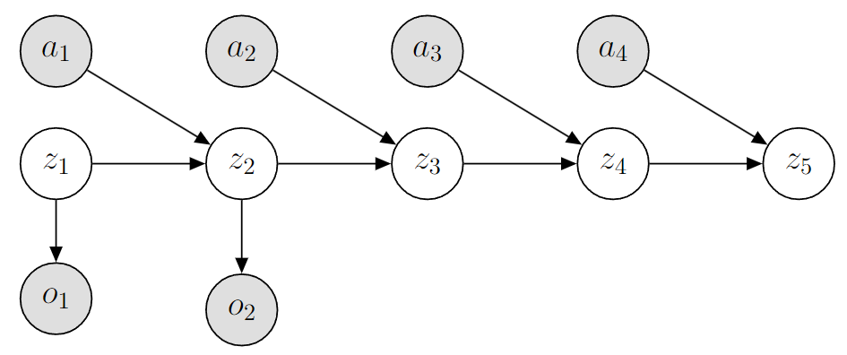
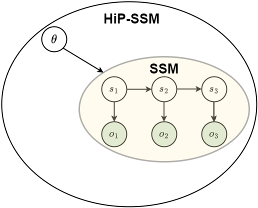

# Papers and Models

This repository contains the implemenation of several projects (papers and associated models) related to MTS3 which were also used as basleines.
This document contains a brief overview of the history of MTS3-related work and how they relate to each other.


## (Action Conditional) Recurrent Kalman Networks (CoRL 2020)
<figure class="image">
  
  <figcaption>Figure: PGM of AcRKN with principled action conditioning.</figcaption>

</figure>

> **Action-Conditional Recurrent Kalman Networks For Forward and Inverse Dynamics Learning**\
> Vaisakh Shaj, Philipp Becker, Dieter Buchler, Harit Pandya, Niels van Duijkeren, C. James Taylor, Marc Hanheide, Gerhard Neumann \
> Paper: https://arxiv.org/abs/2010.10201

> Ac-RKN was motivated by extending the previous ICML 2019 work [RKN](https://arxiv.org/abs/1905.07357) from the same lab and coauthors, to action-conditional settings, which is critical for learning World Models. 
> The paper primarily focused on modelling real robot dynamics including the ones with electric, pneumatic and hydraulic actuators.

## Hidden Parameter State Space Models (ICLR 2022)
<figure class="image">
  
  <figcaption>Figure: HiP-SSM models a set of SSMs for each value of latent varaible theta.</figcaption>

</figure>

> **Hidden Parameter Recurrent State Space Models For Changing Dynamics Scenarios**\
> Vaisakh Shaj, Dieter Buchler, Rohit Sonker, Philipp Becker, Gerhard Neumann\
> Paper: https://arxiv.org/abs/2206.14697

> HiP-RSSM builds upon Ac-RKN to modelling Non-Stationary/Changing Dynamics with a hierarchical latent task variable. You can think of it as performing meta-learning on Kalman Filters. 

## Multi Time Scale World Models (Neurips 2023 - Spotlight)

<figure class="image">
  
  <figcaption>Figure: PGM of a 2-Level MTS3</figcaption>

</figure>

> **Multi Time Scale World Models**\
> Vaisakh Shaj, Saleh Gholam Zadeh, Ozan Demir, Luiz Ricardo Douat, Gerhard Neumann\
> Paper: https://arxiv.org/abs/2310.18534

> Extending the concept of latent task as a form of abstraction, MTS3 propose a formalism for learning world models at multiple temporal abstractions. This important for long horizon predicitons (higher abstractions predict long term trends while lower abstractions predict short term dynamics) and for learning hierarchical policies.


# Citations

If you use this codebase, or otherwise found our work valuable, please cite the relevant papers.
```
@article{shaj2023multi,
  title={Multi Time Scale World Models},
  author={Shaj, Vaisakh and Zadeh, Saleh Gholam and Demir, Ozan and Douat, Luiz Ricardo and Neumann, Gerhard},
  journal={arXiv preprint arXiv:2310.18534},
  year={2023}
}
@article{shaj2022hidden,
  title={Hidden parameter recurrent state space models for changing dynamics scenarios},
  author={Shaj, Vaisakh and Buchler, Dieter and Sonker, Rohit and Becker, Philipp and Neumann, Gerhard},
  journal={arXiv preprint arXiv:2206.14697},
  year={2022}
}
@inproceedings{shaj2021action,
  title={Action-conditional recurrent kalman networks for forward and inverse dynamics learning},
  author={Shaj, Vaisakh and Becker, Philipp and B{\"u}chler, Dieter and Pandya, Harit and van Duijkeren, Niels and Taylor, C James and Hanheide, Marc and Neumann, Gerhard},
  booktitle={Conference on Robot Learning},
  pages={765--781},
  year={2021},
  organization={PMLR}
}
@inproceedings{becker2019recurrent,
  title={Recurrent kalman networks: Factorized inference in high-dimensional deep feature spaces},
  author={Becker, Philipp and Pandya, Harit and Gebhardt, Gregor and Zhao, Cheng and Taylor, C James and Neumann, Gerhard},
  booktitle={International conference on machine learning},
  pages={544--552},
  year={2019},
  organization={PMLR}
}
```
