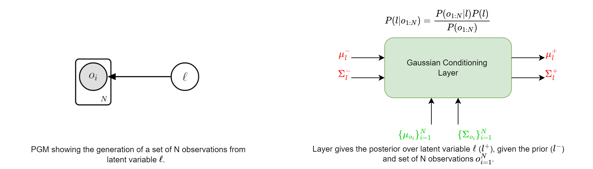

# Multi Time Scale World Models

This is the official implementation of the [NeurIPS 2023](https://nips.cc/) **SPOTLIGHT** paper "Multi Time Scale World Models".
<figure class="image">
  
  <figcaption>Figure: PGM of a 2 Level MTS3 (Multi Time Scale State Space Model)</figcaption>

</figure>

# Requirements
The repository is build on Python 3.10 and Pytorch==1.13.1 and we are working on a migration of pytorch 2.1.0. All necessary packages are listed in requirements.txt.

Example installation:
```
conda create --name mts3 python=3.10
conda activate mts3
pip install -r requirements.txt
```
# Table Of Contents
-  [In a Nutshell](#in-a-nutshell)
-  [In Details](#in-details)
- [MTS3 Architecture](#mts3-architecture)
- [Building Blocks (Gaussian Transformations)](#building-blocks-gaussian-transformations)
-  [Future Work](#future-work)
-  [Contributing](#contributing)
-  [Acknowledgments](#acknowledgments)

# In a Nutshell

# In Details
```
MTS3
├── agent
│   ├── Infer
│   │   └── repre_infer_mts3.py - this file contains the inferene process
│   │ 
│   │
│   ├── Learn
│   │   └── repre_learn_mts3.py - this file contains the training/learning loops 
│   │ 
│   │
│   └── worldModels
│       ├── Decoders - this folder contains the decoders of different types
│       │   └── propDecoder.py - this file contains the decoder for the proprioceptive sensor 
│       │   
│       │ 
│       ├── gaussianTransformations - this folder contains the generic gaussian layers (see layers section)
│       │   ├── gaussian_conditioning.py 
│       │   └──  gaussian_marginalization.py 
│       │  
│       │  
│       └── SensorEncoders - this folder contains the encoders for the different sensor modalities
│       │   └──  propEncoder.py - this file contains the encoder for the proprioceptive sensor
│       │ 
│       │ 
│       ├── MTS3.py - this file contains the MTS3 model nn.Module
│       ├── hipRSSM.py - this file contains the hipRSSM model nn.Module
│       └──  acRKN.py - this file contains the acRKN model nn.Module
│       
│       
├── dataFolder
│   └──
│
│
├── experiments
│   │   
│   ├── mobileRobot
│   │   ├── conf
│   │   │   ├── data
│   │   │   ├── learn
│   │   │   ├── default_mts3.yaml
│   │   │   ├── default_acrkn.yaml
│   │   │   └── default_hiprssm.yaml
│   │   ├── mts3_exp.py
│   │   ├── acrkn_exp.py
│   │   └── hiprssm_exp.py
│   │       
│   ├── logs
│   │   └── output
│   │ 
│   ├──  saved_models
│   │ 
│   ├── exp_prediction_mts3.py
│   ├── exp_prediction_acrkn.py
│   └── exp_prediction_hiprssm.py
|
│
└── utils

```

# MTS3 Architecture

<figure class="image">
  
  <figcaption></figcaption>

</figure>


The <font color="orange">**task predict**</font> (slow time scale) and **task-conditional state predict** (fast time scale) are instances of <font color="green">**Guassian Marginalization operiation**</font>.
The <font color="orange">**task update**</font> (slow time scale) and **Observation update** (fast time scale) are instances of <font color="green">**Guassian Conditioning operiation**</font>.

Thus the MTS3 model can be viewed as a hierarchical composition of Gaussian Conditioning and Gaussian Marginalization operations. The [building blocks](#building-blocks-gaussian-transformation) of these operations are described in the next section.

# Building Blocks (Gaussian Transformations)

The following building blocks are used in the MTS3 model to perform inference in each timescale. They can be broadly categorized into two types of [layers/gaussian transformations](https://github.com/vaisakh-shaj/MTS3/tree/master/agent/worldModels/gaussianTransformations): Gaussian Conditioning and Gaussian Marginalization. These building blocks can be used to construct MTS3 with arbitatry number of timescales.

## Gaussian Conditioning
The observation/task update and abstract action inference at every timescale are instances of this layer. It performs the posterior inference over latent state given a set of observations and the prior distribution (see the PGM below).
<figure class="image">
  
  <figcaption></figcaption>

</figure>


## Gaussian Marginalization
The predict step in every timescale is an instance of this layer. It calculates the marginal distribution of the latent state in the next timestep, given a set of causal factors (see the PGM below).
<figure class="image">
  
  <figcaption></figcaption>

</figure>

### Note: 
The mean and covariance of all the gaussian random variables in latent states have the following structure. The derivations are based on this factorization assumption, 
which allows for scalable inference without compromising on the expressiveness of the model.

<figure class="image">
  
  <figcaption></figcaption>

# Future Work


# Contributing


# Acknowledgments


